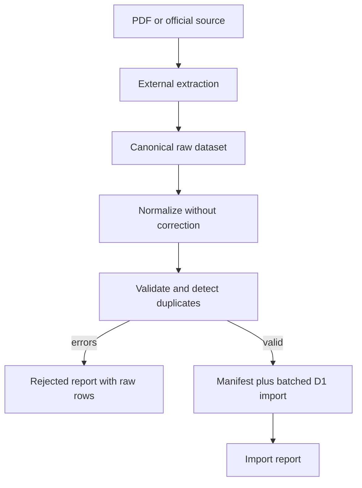

# NJKB ingestion pipeline

## Scope

The Phase 4 importer starts from canonical JSON/CSV. Phase 7 adds separate,
document-specific deterministic extractors that produce those canonical files and
machine-readable QA reports. Extraction remains outside the D1 writer: no source
row is written until canonical validation succeeds. Ambiguous OCR/table rows stay
in the QA artifact and are never guessed or silently discarded.



## Canonical JSON

Complete examples:

- `fixtures/canonical/pergub-ntt-26-2025.sample.json`
- `fixtures/canonical/permendagri-11-2026.sample.json`

Minimal shape:

```json
{
  "schema_version": 2,
  "manifest": {
    "dataset_id": "pergub-ntt-26-2025-part-a-sample-v1",
    "created_at": "2026-09-20T00:00:00Z",
    "regulation": { "id": "reg-a" },
    "source_document": {
      "id": "doc-a",
      "sha256": "94798b35378003ac2fb85c9b239327fd7e0fab91bbab2b1e89ef91cd0a100c18",
      "page_count": 690
    },
    "edition": {
      "id": "edition-2025",
      "tax_year": 2025,
      "vehicle_year_min": 1900,
      "vehicle_year_max": 2025
    },
    "extraction": {
      "method": "manual_transcription",
      "tool": "visual-review",
      "tool_version": "1"
    },
    "defaults": {
      "section": "A.13",
      "vehicle_category": "SEPEDA MOTOR RODA DUA"
    }
  },
  "records": [{
    "source": { "pdf_page": 503, "source_row": "5310" },
    "raw": {
      "NO": "5310",
      "KODING": "701167 08549",
      "MERK": "HONDA",
      "TYPE": "C1M02N42L1 A/T",
      "TAHUN_BUAT": "2024",
      "NJKB": "12.500.000",
      "BOBOT": "1",
      "DP_PKB": "12.500.000"
    },
    "review": { "status": "verified", "note": "Visually verified." }
  }]
}
```

`tax_year` dalam format ini mengidentifikasi edisi regulasi dan tetap disimpan
sebagai provenance. Field tersebut bukan parameter lookup API; record diresolusi
dengan `vehicle_year` dan identitas kendaraan dalam edisi yang approved dan efektif.

The shortened metadata objects above are illustrative only; use the complete sample
files because regulation, document, and edition schemas are strict.

## Canonical CSV

CSV requires the adjacent `<dataset>.csv.manifest.json` sidecar. Required columns:

```text
pdf_page,source_row,section,vehicle_category,review_status,review_note,
NO,KODING,MERK,TYPE,TAHUN_BUAT,NJKB,BOBOT,DP_PKB
```

`section` and `vehicle_category` may be empty to use manifest defaults. The parser
supports RFC-style quoted fields, embedded commas, escaped quotes, CRLF, and quoted
newlines. A row with the wrong number of cells becomes a `malformed_record` issue;
it is not silently skipped.

## Numeric rules

- `NJKB` and `DP_PKB` accept whole-rupiah digits or correctly grouped Indonesian
  thousands such as `12.500.000`. No floating-point storage or automatic rounding.
- `BOBOT` accepts a non-negative decimal with up to six places using comma or dot as
  decimal separator. It is converted using integer arithmetic to `weight_micros`.
- DPP validation uses exact bigint arithmetic: `NJKB × weight_micros / 1,000,000`.
- Values such as `12.500,00`, negative numbers, unsafe integers, and invalid years
  become errors. Their raw values remain in the rejected report.

## Duplicate and identity rules

| Condition | Result |
|---|---|
| Same dataset/document hash imported again | `already_imported`, no new rows |
| New manifest, identical document position and normalized values | `unchanged` |
| Same document position appears twice in one dataset | blocking `duplicate_source_position` error |
| Same normalized code and full identity appears on different rows | `duplicate_match_key` warning; both rows retained |
| Same code/year has a conflicting identity | blocking `conflicting_code_identity` error |
| Same code/year/identity has conflicting monetary values | blocking `conflicting_njkb` error |
| Different codes share exact brand/type/year/category | `duplicate_identity` warning; no mapping created |
| Vehicle year is outside the persisted edition scope | blocking `out_of_edition_scope` error and D1 trigger rejection |
| Existing source position has changed raw or normalized evidence | blocking `existing_source_conflict` error |
| Same document hash supplied under another source ID | blocking `document_identity_conflict` error |
| Different document hash | distinct provenance; historical row preserved |

Duplicate matching identities are never merged. Import does not create aliases or
run fuzzy matching. Verified duplicates can therefore surface later as `ambiguous`,
which is safer than selecting one silently.

## D1 write behavior

Validation completes before any reference writes. A rejected dataset writes no
manifest or NJKB row; the JSON report preserves every rejected raw record and its
partial normalized values. Valid imports use chunks of at most 30 records, keeping
the number of D1 statements bounded. Each record and its ingestion provenance are
written in the same D1 batch.

`ingestion_manifests.status='importing'` makes interrupted imports resumable.
Deterministic record IDs, immutable evidence checks, and idempotent staging records
prevent duplicates on retry. Completion stores inserted/unchanged/warning counts.

## CLI and reports

```sh
npm run import:njkb -- dataset.json
npm run import:njkb -- dataset.csv --report reports/dataset-report.json
```

Without `--report`, output is written to `<dataset>.import-report.json`. Exit code 2
means validation rejection; infrastructure/parser failures use a normal command
failure. `docs/examples/import-report.sample.json` shows a successful import where
the verified Phase 1 fixture was recognized as unchanged.

## Phase 7 full-dataset workflow

Use a fresh migrated local D1 state; do not seed `fixtures/verified.json` into the
Phase 7 import database. Verified fixtures remain unit/regression evidence, while
full canonical datasets have independent extraction provenance.

```sh
npm run db:migrate
npm run import:njkb -- fixtures/canonical/pergub-ntt-26-2025.full.json
npm run import:njkb -- fixtures/canonical/permendagri-11-2026.full.json
npm run phase7:verify:local -- \
  fixtures/canonical/pergub-ntt-26-2025.full.json \
  fixtures/canonical/permendagri-11-2026.full.json
```

Extraction scripts require local source PDFs whose SHA-256 matches the pinned source
hash. They emit canonical JSON plus `docs/evidence/*.extraction-qa.json`. QA records
every accepted, invalid, conflicting, missing-sequence, and ambiguous source row.
An extraction with unresolved rows is a partial validated dataset, not a claim of
complete source coverage. Phase 7C requires an exact disposition equation over the
source sequence, including explicit `SOURCE_NUMBERING_GAP`. Reason tags can overlap;
terminal dispositions cannot. See `docs/phase7c-final-resolution.md`.
