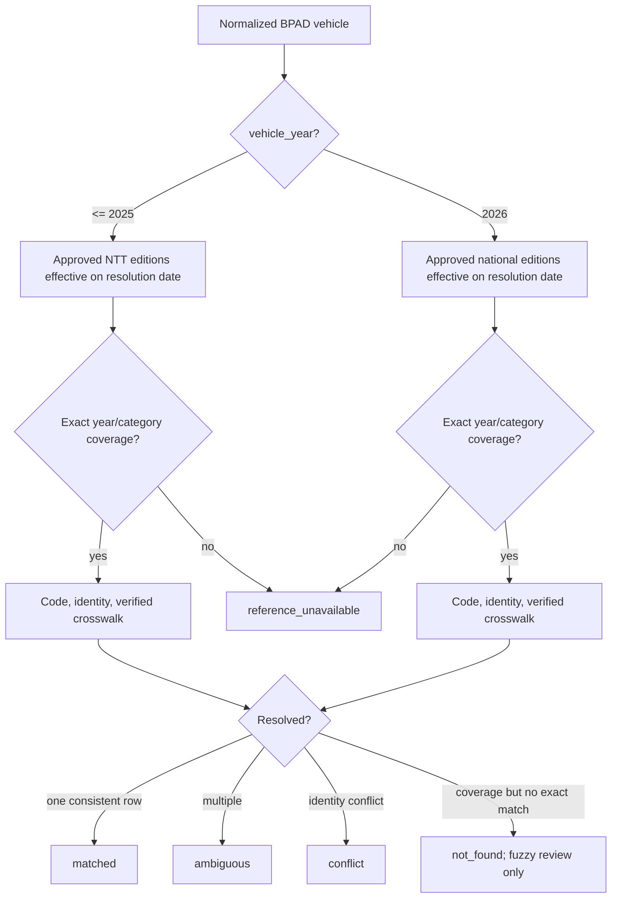

# Vehicle-year NJKB resolution

The engine receives the normalized BPAD identity and a server-controlled `resolution_as_of` date. It never receives a client tax year.

## Regulatory boundary (Phase 6 final decision)

```
vehicle_year <= 2025 → Pergub NTT No. 26 Tahun 2025 (NTT, approved)
vehicle_year = 2026  → Permendagri No. 11 Tahun 2026 (ID, approved)
```

No cross-tier fallback. A pre-2026 vehicle must not resolve from the national 2026
edition; a 2026 vehicle must not resolve from the provincial edition.



## Invariants

1. `vehicle_year` is part of every candidate lookup and mapping lookup.
2. An edition must be `approved`, effective on `resolution_as_of`, and contain verified coverage for the exact year/category.
3. The authority tier is selected by `vehicle_year` (≤2025 → NTT; 2026 → national). No cross-tier fallback.
4. Exact full code is followed by exact normalized brand/type/year/category, then an explicitly verified crosswalk.
5. Fuzzy similarity can only populate internal review candidates and never carries an NJKB into the public response.
6. Code hits are checked against brand, type, category, and year. A disagreement is `conflict`.
7. The engine never substitutes a different vehicle year and never estimates a value.
8. `701167 08549` and `701167 67749` have no automatic relationship.

`reference_unavailable` means authoritative coverage is missing. `not_found` means authoritative coverage exists but the requested identity was not found. These conditions are deliberately distinct.
