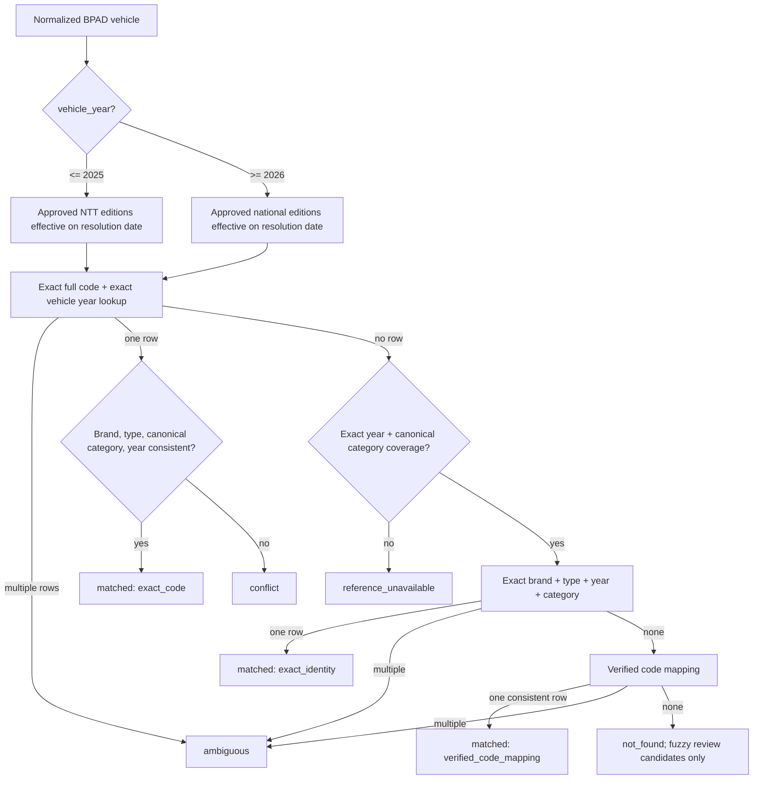

# Vehicle-year NJKB resolution

The engine receives the normalized BPAD identity and a server-controlled
`resolution_as_of` date. It never receives a client tax year.

## Regulatory boundary

```text
vehicle_year <= 2025 → Pergub NTT No. 26 Tahun 2025 (NTT, approved)
vehicle_year = 2026  → Permendagri No. 11 Tahun 2026 (ID, approved)
vehicle_year >= 2027 → reference_unavailable until a future approved edition exists
```

No cross-tier or adjacent-year fallback.

## Category vocabulary normalization

BPAD uses granular vehicle categories while regulatory datasets use canonical groups.
Normalization happens before matching through explicit verified aliases only:

| BPAD | Canonical regulatory category |
|---|---|
| SEPEDA MOTOR / SEPEDA MOTOR RODA 2 | SEPEDA MOTOR RODA DUA |
| SPM R3 | SEPEDA MOTOR RODA TIGA |
| SEDAN / JEEP / MINIBUS | MOBIL PENUMPANG |
| PICK UP / BLIND VAN / LIGHT TRUCK / TRUCK | MOBIL BARANG |
| MICROBUS / MOBIL BUS* / BUS* | BUS |

Canonical prefixes `MOBIL PENUMPANG*` and `MOBIL BARANG*` remain supported. Unknown,
blank, and unverified categories such as `DOUBLE CABIN` are preserved after normal
string normalization and are never guessed or fuzzily classified.

## Matching flow



## Invariants

1. `vehicle_year` is part of every code, identity, and verified-mapping lookup.
2. An edition must be `approved` and effective on `resolution_as_of`.
3. Authority tier is selected by vehicle year; no cross-tier fallback.
4. Exact full code + exact year executes before category coverage gating.
5. Exact-code hits still require brand, type, canonical category, and year consistency;
   a genuine disagreement is `conflict`.
6. Category/year coverage gates only the identity/mapping/review path after exact-code miss.
7. Exact identity requires brand + type + year + canonical category.
8. Only explicitly verified code mappings can resolve after code and identity miss.
9. Fuzzy similarity can only populate internal review candidates and never carries an
   NJKB into the public response.
10. The engine never substitutes another vehicle year or estimates NJKB.
11. Category normalization never creates a persistent vehicle code alias/mapping.

`reference_unavailable` means approved regulatory coverage is unavailable for the exact
year and canonical category after exact-code miss. `not_found` means approved coverage
exists but no exact identity or verified mapping was found.
